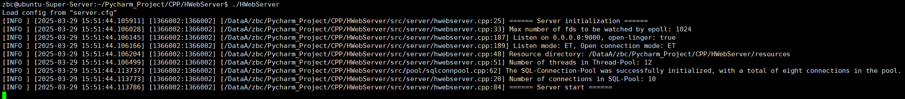
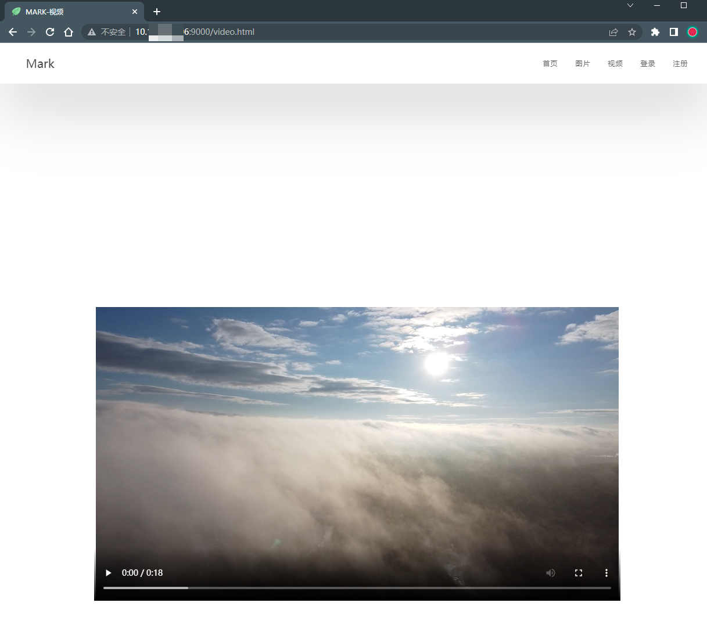

# HWebServer
A High-performance WebServer.

## 简介

技术支持：C++、 CMake、 C/S 模式、 Linux 环境

功能： 

- 自定义MySQL数据库连接池，避免连接频繁创建和销毁，基于RAII设计思想； 
- 自定义I/O多路复用Epoll类和线程池实现多并发；
- 自定义自增长Buffer缓冲区；
- 自定义阻塞双端队列和单例模式日志类实现日志异步记录；
- 自定义小根堆Timer来检测关闭过期的非活动连接；
- 采用正则解析Http请求来处理静态资源。
- 用户注册登录暂不实现

## 编译

```txt
mkdir build && cd build
cmake ..
make
../HWebServer
```

## 运行测试

服务端启动



客户端访问

请求图片资源测试


请求视频资源测试



## 参考

```c++
WebServer: https://github.com/markparticle/WebServer
Yawn: https://github.com/fansuregrin/Yawn
```

# End
